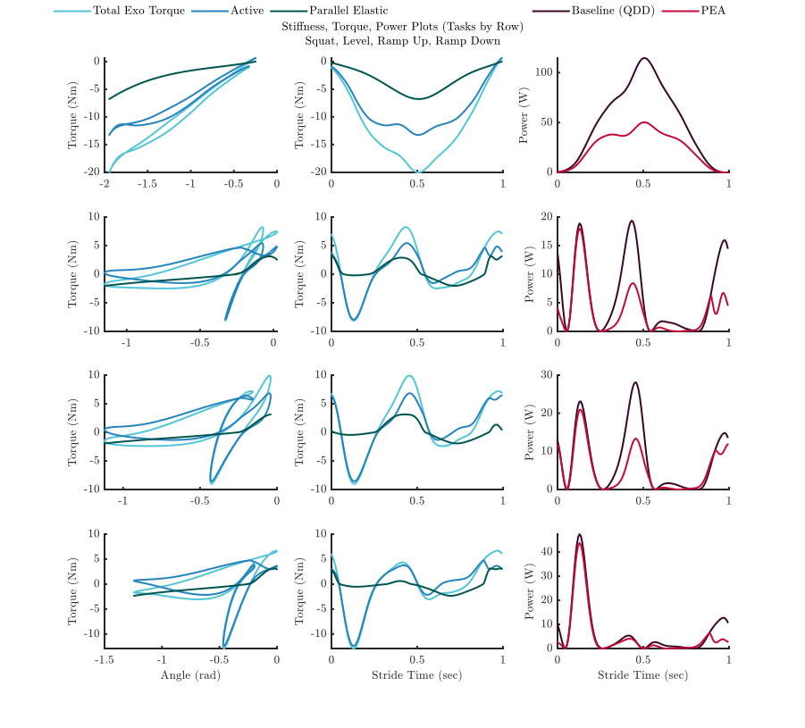
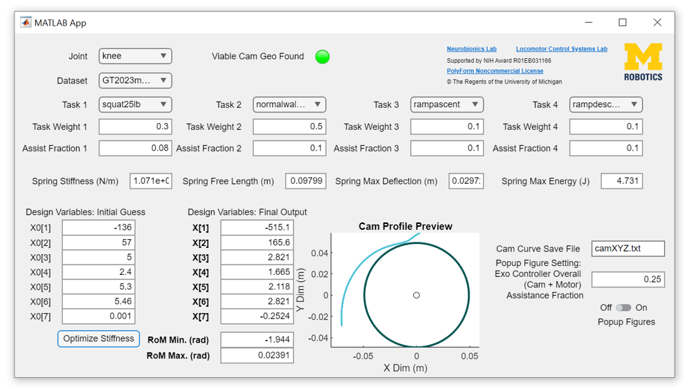

# MBLUE-PEA Cam Design Tool
a software tool that facilitates the design of cam profiles for PEA module to augment M-BLUE

    
  
   
  

## DOWNLOAD:
Download the [latest app installer release](https://github.com/neslerc-UM/MBLUE-PEA/releases/tag/CamGenApp).  

# Design Stage 1: Stiffness Profile Generation

Before choosing a spring or designing a cam surface, we must determine what torque-angle relationship to render. This consists of the following steps: 

**Task Selection:** Occurs at the top of _OptimizationWrapper.m_

  - Define how many tasks to optimize for, and what those tasks are
  - Dataset Selection: we are using the Georgia Tech 2023 Dataset, for which we have taken all-subject averages
  - Parameter Selection (assistance fractions, task weights, subject mass)
   - Define the joint that will be assisted and what actuator will be used.
    -If new datasets or actuators are to be used, update the _getGaitData.m_ or _getActuatorData.m_ to reflect the change. 

**Objective Function Selection:** Defined in _I2Rcostfunc.m_ 

- The objective function defines what the optimizer will try to minimize. We used the Joule heating across tasks, each weighted by their assistance fraction and task weight.
- The form of the stiffness function is defined here as the function’s first input argument, as well as in _OptimizationWrapper.m_. For the work in Nestani et. al., 2024, we use a piecewise cubic polynomial, where the coefficients and transition point are selected by the optimizer. If the stiffness is to be parameterized by a different functional form, the beginning of _viableTAfunc_optionaloutputs_cubicK_arbitspring.m_ must be updated to reflect that. 

**Design Optimization:**  Occurs in _OptimizationWrapper.m_
-Initial Guess: Once your code is configured, run it with many initial guesses and observe trends in the optimizer’s convergence behavior. Exploration of the design space helps find and avoid suboptimal local minima and valleys
-Constraints: Apply any constraints to the optimization. We apply a linear constraint to enforce equality of the first order coefficients of the two piecewise function halves. This is equivalent to requiring the first derivative of the two functions to be equal at the point where they meet.

# Design Stage 2: Cam Embodiment of Stiffness Profile 

Now that the desired stiffness function is defined, the corresponding cam surface can be calculated.

**Spring Selection:**
Since mechanical work is the integral under the torque-angle curve, we can determine whether a spring is a candidate by comparing its potential energy storage at maximum deflection to the sum of the preload energy at the cam equilibrium angle and the work under the stiffness curve between equilibrium and the range of motion limit (as there are two directions, use the greater magnitude work value). If the spring’s potential energy capacity is greater than that sum, it is a potentially viable choice.
You should also consider such factors as the tradeoff between open-loop “resolution” and cam mass. Imagine a stiffer and more compliant spring of equal mass and potential energy capacity: A stiffer spring will require less deflection to achieve comparable torques, meaning the cam can be of a smaller volume (and mass). However, the change in work per unit spring deflection is greater in the stiffer spring, so one unit of error between expected and actual deflection causes a greater discrepancy between expected and actual torque production.

**Range of Motion Selection:**

Set the range of motion over which the cam will produce the designed stiffness profile. Depending on how close to max compression the spring gets at the tasks' range of motion limits, you may want to taper the cam profile heuristically in CAD. The stiffness can either be lessened, or made to taper to zero torque (occurs when the cam surface is concentric about the joint axis).

**Conversion to CAD**

Follow the following steps to create a basic CAD model of the cam. 

- Open Solidworks
- Navigate the drop down menus Insert > Curve > Curve Through XYZ Points
- In the pop-up window, click Browse to bring up file explorer window
- Switch the file type from *.sldcrv to *.txt in the dropdown menu
- Navigate to the folder containing your cam surface *.txt, click the file, click Open
- Once a matrix of XYZ points populates the Curve File window, click OK
- Start new Front Plane sketch
- Use the Convert Entities tool in the Sketch tab to make the surface curve an elemnt of the sketch
- Sketch a circle of the same diameter as the actuator (48mm for the AK80-9) centered at the origin
- Make any modifications of extensions desired to the curve (e.g., tapering to a circular profile centered on the origin to increase the mechanism's range of motion without further compression of the spring) 
- Draw lines from the end points of the surface curature to the motor diameter
- Use the Extrude Boss/Base feature in the Features tab to convert the closed geometry into a solid body of desired thickness
- Make a cutout in the part to indicate joint angle zero (a vertical line in the Front Plane coincident with the origin)
- Import cam part into PEA assembly
- Add concentricity mate between the outer surface of the actuator and the inner surface of the cam
- Add a parallel mate between the cutout surface of the cam and the long edge of the M-BLUE upright to orient the cam rotationally   

Recommendation: After producing a satisfactory stiffness curve and corresponding cam surface, renaming the cam geometry .txt file and saving a compressed version of the project folder for future reference ensures the cam's relevant information is retained.

# Glossary of MATLAB Files

_CWvectorRotate90.m:_
Rotates a vector by 90 degrees, clockwise

_ddt_open.m:_
Performs numeric derivatives.

_definecolorset.m:_
	Defines colors used by multiplot displaying effect of using PEA on optimization tasks.

_getActuatorData.m:_ 
	Input: String representing name of actuator to be used for PEA device.
Output: Structure of useful motor parameters for that actuator.

_getGaitData.m:_
Input: Strings representing the dataset (e.g., ‘bovi’), joint (e.g., ‘ankle’), task (e.g., ‘normalwalk’), and subject number (e.g., ‘AB02’; update if applicable, otherwise use any placeholder string).
Output: Torque, joint angle, velocity, acceleration, and stride time vectors

_I2Rcostfunc.m:_
* Inputs:
  * X: a row vector containing all decision variables for optimization
  * motor_params: a structure containing necessary properties for selected actuator 
  * theta_alltasks: a matrix wherein each column is a task’s joint angle trajectory
  * theta_d_alltasks: a matrix wherein each column is a task’s joint velocity trajectory
  * theta_dd_alltasks: a matrix wherein each column is a task’s joint acceleration trajectory
  * stridetime_alltasks: a matrix wherein each column is a task’s timesteps for all samples
  * exoTorque_alltasks: a matrix wherein each column is a task’s joint torque trajectory, each scaled by the appropriate assistance fraction
  * taskweights: a row vector containing weights for each task’s relative prevalence
* Outputs:
  * I2Rloss_total: This is the minimization variable. It is a scalar value of weighed Joule heating energy loss summed across tasks
  * i2r: a matrix wherein each column is the Joule heating power trajectory for a task
  * residualTorque: a matrix wherein each column is the torque trajectory that the motor/actuator must generate for the PEA to produce the corresponding total device torque found in input exoTorque_alltasks for a given task.
  * cubicTorque: a matrix wherein each column is the torque trajectory that the parallel elastic element will generate for a given task.
  * IVenergyUse: a row vector wherein each scalar corresponds to the Joule heating energy (weighted by corresponding taskweights value) for a task cycle when PEA is used.
  * IVpow: a matrix wherein each column is the elementwise product of a task’s current and voltage trajectories
  * current: a matrix wherein each column is the current required of the motor to produce the corresponding residualTorque trajectory.

_InterX.m:_
A function to find self intersections of the cam surface curve. 
Source: NS (2024). Curve intersections (https://www.mathworks.com/matlabcentral/fileexchange/22441-curve-intersections), MATLAB Central File Exchange. Retrieved June 18, 2024.

_OptimizationWrapper.m:_
The top-level script of the project. It defines task trajectories, executes optimization of the stiffness profile, and feeds that profile to viableTAfunc_optionaloutputs_cubicK_arbitspring.m to find a cam geometry capable of rendering that function over a given range, given specified hardware parameters. 

_SpringTableOrganizer.m:_ 
This script creates/adds columns to a table of candidate springs from a spring vendor (MW Components). It does not directly interact with the other MATLAB scripts, but is useful for finding a good spring for your application. Generally, you will want to pick the spring with the highest potential energy storage capacity that still meets all other needs of the application.

_viableTAfunc_optionaloutputs_cubicK_arbitspring.m:_
* Inputs:
  * X: the design variables that parameterize the stiffness curve to be rendered
  * thetamin: the minimum limit of the range of motion over which the stiffness curve must be rendered by the cam
  * thetamax: the maximum limit of the range of motion over which the stiffness curve must be rendered by the cam
  * springparams: a structure containing properties of the coil compression spring to be used with the cam being designed
  * preloadenergy: the amount of energy that will be stored in the spring when the mechanism is at its equilibrium angle
  * camsaveY1N0: a binary value indicating whether or not to save the generated cam geometry to a file (“cam_surface_pointsDEBUG.txt” by default) upon completion. Reminder: change the name of the generated file before running the routine again if you do not want it to be overwritten.
 

# App Version

The app that deploys the GUI at the top of the readme may be installed to MATLAB by downloading and running the file _CamGenerationPEA.mlappinstall_ in the app folder of the repository.

Dependencies: MATLAB installation with Optimization Toolbox

The source code for this tool, located in  in app/src/, is based on the full architecture described above with changes to two files:

_Optimizer.m_ has replaced _OptimizationWrapper.m_

_cam_surf_gen.m_ has replaced _viableTAfunc_optionaloutputs_cubicK_arbitspring.m_

The core function of these files parallels that of the files they replace, but their names are different to distinguish them.

**Use:**

The app currently supports the use of hip, knee, and ankle data from the Georgia Tech 2023 Dataset for the following tasks:

* Squat Lift (25 lbs.)
* Level Walking (1.2 m/s)
* Ramp Ascent (5 degree incline)
* Ramp Descent (5 degree decline)

_Key User Inputs:_
* Joint Selection
* Dataset
* Task 1
  * Task
  * Assistance Fraction
  * Task Weight
* Spring Parameters
* X0: initial guess for the stiffness function parameters

_Secondary Inputs:_
* Tasks 2-4 are optional, and should be added progressively in ascending order
* Popup Figure Toggle Switch: Indicate whether or not to create the following popup plots
  * Multiplot with impact of PEA module on each task's stiffness, torque, power (ex. figure at top of readme). Each row corresponds to the input task of the same number.
  * Progenitor offset curve plot, showing the base curve for the cam geometry alongside the version offset by follower bearing radius
  * Polar plot of cam geometry alongside circle representing the actuator for scale
* Multiplot assistance percentage: This value indicates the _total_ assistance fraction provided by the exoskeleton in the multiplot figures
* Cam curve save file: this is where a successfully generated cam's geometry will be saved for use in CAD modeling

_Outputs:_
* X: Parameterization of the optimized stiffness curve
* RoM Maximum/Minimum: Rang of motion limits of the rendered cam surface (encompasses all extrema of selected optimization task angle trajectories)
* Cam Profile Preview: An embedded plot of the generated cam surface and actuator profile circle
* Viable Cam Geo Found: A light to indicate whether the tool could generate a viable geometry given the stiffness function and spring properties provided. Green indicates success, red indicates no viable geometry was achieved, grey indicates the routine has not concluded.
* Popup Figures (described above) 
